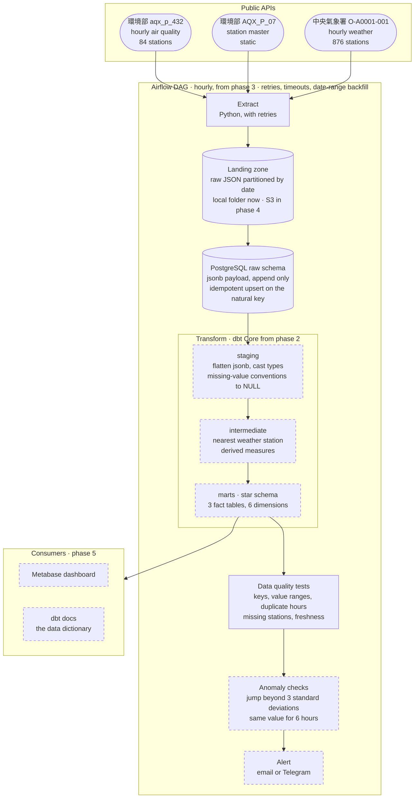

# Taiwan Air Quality Pipeline

An hourly data pipeline that ingests Taiwan's public air-quality and weather station readings,
lands the raw JSON, loads it into a PostgreSQL warehouse modelled as a star schema, tests data
quality, flags anomalies, and is orchestrated by Airflow.

> **Status: work in progress.** Phase 0 (design) is complete. Phase 1 (PostgreSQL, SQL, dimensional
> modelling) is in progress. See [Roadmap](#roadmap).

## Architecture



Solid outlines are built or in progress. Dashed outlines arrive in a later phase, in the order set
out in the [Roadmap](#roadmap). The star schema is specified in [docs/schema.md](docs/schema.md).
Every stage downstream of the landing zone can be re-run from the stored JSON without calling the
APIs again.

## The questions this answers

The intended user is an environmental monitoring engineer who wants to know, every morning:

- Which stations exceeded the PM2.5 limit yesterday, and for how many hours?
- What is each county's AQI trend this month, and how does it compare with the same month last year?
- How does PM2.5 move when wind speed or rainfall changes?
- Which stations have bad data: missing hours, negative values, the same value repeated for six hours?

## Data sources

All three are free public APIs and require a registered key.

| Source | Dataset | Platform | Cadence | Scale |
|---|---|---|---|---|
| Hourly air quality by station | [aqx_p_432](https://data.moenv.gov.tw/dataset/detail/aqx_p_432) | Ministry of Environment (環境部) | hourly | ~84 stations |
| Air quality station master data | [AQX_P_07](https://data.moenv.gov.tw/dataset/detail/AQX_P_07) | Ministry of Environment (環境部) | static | ~84 stations |
| Automatic weather station observations | [O-A0001-001](https://opendata.cwa.gov.tw/dataset/observation/O-A0001-001) | Central Weather Administration (中央氣象署) | hourly | ~876 stations |

Each air-quality station is joined to its nearest weather station by coordinates. See
[Coordinate system](docs/decisionlog.md#coordinate-system) for why this needs care.

## What this project demonstrates

| Area | How |
|---|---|
| PostgreSQL | Star schema, partitioning, indexes, roles and grants, `pg_dump` backup and restore |
| SQL | Window functions, CTEs, `EXPLAIN ANALYZE`, upsert semantics, transactions |
| Dimensional modelling | Kimball star schema: declared grain, conformed dimensions, additivity documented |
| Data quality | Schema tests plus custom tests for value ranges, duplicate hours, missing stations, staleness |
| ELT | dbt Core with staging, intermediate and marts layers; incremental models; generated docs |
| Orchestration | Airflow DAG with retries, timeouts, catchup and date-range backfill |
| Cloud | AWS S3 landing zone, RDS PostgreSQL, IAM least privilege, billing alarm |
| Engineering practice | Idempotent loads, replayable raw layer, decision log, CI on every push |

Items below phase 1 are not built yet. The roadmap says where each one lands.

## Documentation

- [Schema](docs/schema.md). Raw layer, three fact tables, seven dimensions, with a declared grain
  for every table.
- [Decision log](docs/decisionlog.md). Why a long fact table, why `timestamptz`, which coordinate
  system, how each source marks missing values, and the sources that settled each question.

## Running it locally

Requires Docker Desktop and a free API key from each platform above.

```sh
cp .env.example .env    # then fill in your own keys and passwords
docker compose up -d
docker compose ps       # wait for postgres to report healthy
```

Connect with `psql` inside the container:

```sh
docker compose exec postgres psql -U "$POSTGRES_USER" -d "$POSTGRES_DB"
```

Or open pgAdmin at [localhost:5050](http://localhost:5050) and register a server with host
`postgres` and port `5432`. Use the service name, not `localhost`: pgAdmin runs in its own
container.

To stop, keeping the data:

```sh
docker compose down
```

`docker compose down -v` also deletes the volume and every row in the warehouse.

### Environment variables

| Variable | Used by | Note |
|---|---|---|
| `MOENV_API_KEY` | extractor | Ministry of Environment open data platform |
| `CWA_API_KEY` | extractor | Central Weather Administration open data platform |
| `POSTGRES_USER` | postgres, pgadmin | Read on first start only |
| `POSTGRES_PASSWORD` | postgres, pgadmin | Read on first start only |
| `POSTGRES_DB` | postgres, pgadmin | Read on first start only |
| `PGADMIN_DEFAULT_EMAIL` | pgadmin | pgAdmin web login, unrelated to the database user |
| `PGADMIN_DEFAULT_PASSWORD` | pgadmin | pgAdmin web login, unrelated to the database user |

`.env` is gitignored and never committed. The three `POSTGRES_*` variables are only read when the
volume is empty, so changing them later has no effect until the volume is recreated.

## Repository layout

```
docs/       schema sketch and decision log
samples/    one real API response per source, used to design the schema
data/       raw JSON landing zone, partitioned by date (gitignored)
```

## Roadmap

| Phase | Scope | State |
|---|---|---|
| 0 | Design: Docker Compose, schema sketch, decision log | done |
| 1 | PostgreSQL: extractor, raw tables, star schema in hand-written SQL, one year backfill, partitioning, indexes, roles, backup and restore | in progress |
| 2 | dbt Core: staging, intermediate and marts models, source freshness, schema and custom tests, generated docs as the data dictionary | planned |
| 3 | Airflow: hourly DAG for extract, load, transform, test, anomaly check, alert; retries and backfill | planned |
| 4 | AWS: S3 landing zone, RDS PostgreSQL, IAM, CloudWatch, billing alarm | planned |
| 5 | Publish: dbt docs, Metabase dashboard, GitHub Actions running ruff, pytest and dbt build | planned |

## Stack

PostgreSQL 17, Docker Compose, pgAdmin 4, Python 3.12. dbt Core, Apache Airflow, AWS and Metabase
arrive in later phases.
